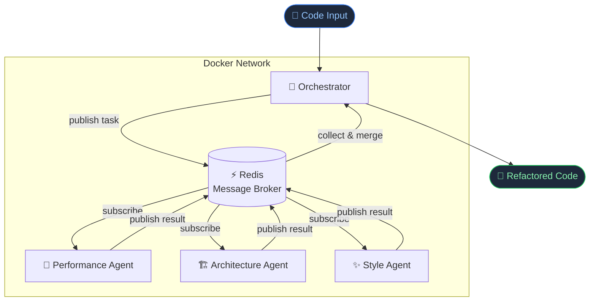

# Multi-Agent-Code-Refactor

**Multi-Agent-Code-Refactor** is a local, microservices-based system designed to optimize code files. Each agent in the system is specialized for a specific aspect of code improvement, including performance enhancement, architecture improvements, and adherence to coding style guidelines. By distributing responsibilities across multiple components, the system can analyze and refactor large codebases efficiently.

## Architecture

**Stack:** Python · Redis · Docker